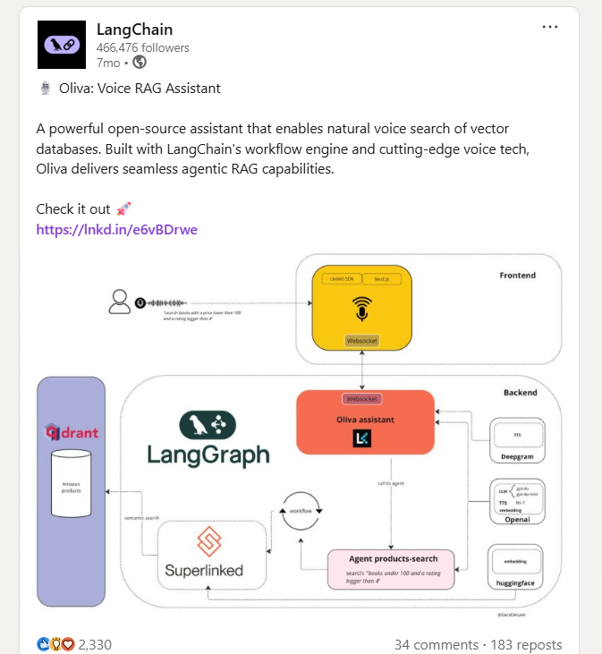

## Hi there 👋 I'm Gerardo

I'm a **Software Engineer** with over **10 years of experience** building applications.

I specialize in **TypeScript**, **Python**, **NestJS**, and **AWS**, and I’m passionate about **AI-driven applications**, including **voice assistants**, **LangChain**, and **multi-agent architectures**.

I combine strong backend expertise with a deep curiosity for **AI orchestration**, **vector databases**, and **real-time voice interfaces** — turning innovative ideas into production-grade solutions.

# Projects

| Project                                                          | Description                                                                                                                                    | Stack                                         |
| ---------------------------------------------------------------- | ---------------------------------------------------------------------------------------------------------------------------------------------- | --------------------------------------------- |
| [**Dybloom**](https://dybloom.com)                               | AI-powered **voice assistant** built with Next.js, LiveKit, Python, and OpenAI. Enables real-time natural conversations and smart automations. | Next.js, Python, OpenAI, ElevenLabs, Deepgram |
| [**Mireino**](https://mireino.com)                               | **RAG-based chatbot** with LangChain.js, Vercel AI SDK, and Tavily. Includes **OAuth login with Google** and vector-based retrieval.           | LangChain.js, OpenAI, Vercel AI SDK           |
| [**Oliva Multi-Agent System**](https://github.com/Deluxer/oliva) | Modular **multi-agent orchestration framework** for chat and voice workflows. Supports **LangGraph** and **external API integrations**.        | LangGraph, LlamaIndex, TypeScript             |
| **EleganteFlor**                                                 | Full-stack **e-commerce platform** built from scratch with payment gateways and CRM integration.                                               | Node.js, Symfony, MongoDB, PrestaShop         |

---
## 🏆 Featured Recognition

I’m truly proud to see my open-source project **[Oliva Multi-Agent System](https://github.com/Deluxer/oliva)** recognized and shared by leading AI infrastructure companies — **LangChain**, **Qdrant**, and **Superlinked**.  
Their support and mentions reinforce Oliva’s mission to enable modular, multi-agent orchestration for chat and voice workflows.

<table>
<tr>
<td width="40%" valign="center" align="center">

</td>
<td width="60%" valign="top">

📢 **Posts & Mentions**

- 🧠 **LangChain** highlighted Oliva's multi-agent approach  
  🔗 [LinkedIn Post](https://www.linkedin.com/feed/update/urn:li:activity:7309242578883727360/)  
  🔗 [Tweet](https://x.com/LangChainAI/status/1903476882060050548)

- ⚡ **Qdrant** showcased Oliva as a real-world example of vector orchestration  
  🔗 [LinkedIn Post](https://www.linkedin.com/feed/update/urn:li:activity:7311703708759744512/)  
  🔗 [Tweet](https://x.com/qdrant_engine/status/1905938017690276339)

- 💬 **Daniel Svonava**, CEO of Superlinked, shared Oliva with his network  
  🔗 [LinkedIn Post](https://www.linkedin.com/feed/update/urn:li:activity:7315766703248822272/)
- **Superlinked** shared Oliva with his network  
  🔗 [LinkedIn Post](https://www.linkedin.com/posts/superlinked_an-ai-voice-assistant-powered-by-superlinked-activity-7305579691891933185-UBUc?utm_source=share&utm_medium=member_desktop&rcm=ACoAAA_NsaYBhdrdf3mF3h7HkRVZB55BE6GGPSw)

</td>
</tr>
</table>

*Seeing Oliva resonate with the AI community inspires me to keep expanding the system with new capabilities, integrations, and open-source contributions.* 🤩

---

# Tech Stack

| Category                   | Technologies                                                     |
| -------------------------- | ---------------------------------------------------------------- |
| **Languages**              | JavaScript (ES6+), TypeScript, Python, PHP                       |
| **Frameworks & Tools**     | NestJS, Next.js, Express, React, Symfony, LangChain, LangGraph   |
| **Cloud & Infrastructure** | AWS (Lambda, EC2, API Gateway, SQS, SNS), Terraform, Docker      |
| **Databases**              | MongoDB, PostgreSQL, MySQL, DocumentDB                           |
| **AI / Voice Tech**        | OpenAI, LlamaIndex, ElevenLabs, Deepgram, LiveKit, Vercel AI SDK |
| **CI/CD & DevOps**         | GitHub Actions, Terraform, Docker                       |
| **Other**                  | REST APIs, JWT Auth, Swagger, OAuth                              |

